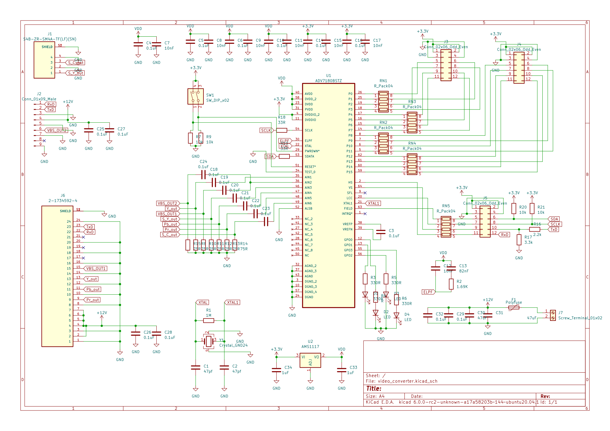
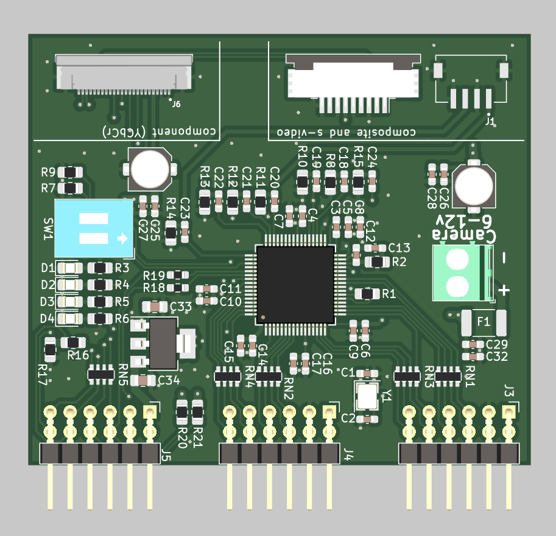
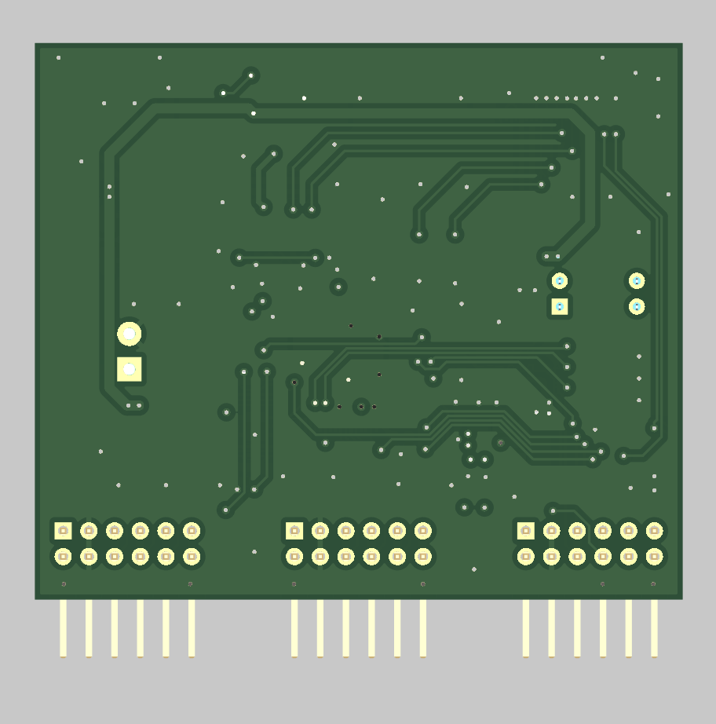

# ADV7180_to_Pmod
These are pcb files for an analog camera block interface board based on the adv7180.

I'm currently working on an implementation for it in Vivado and i'll eventually post the source files to my github aswell.

## Schematic

Schematic for the video converter.

## Pictures

| Front | Back |
|---|---|
| |  |

